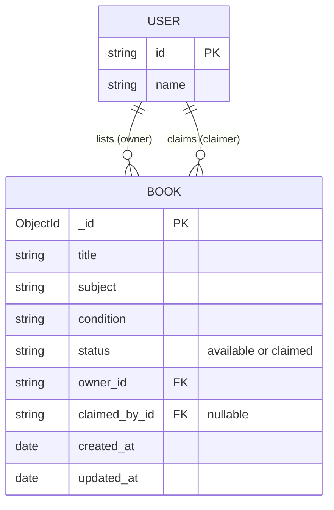

# 📚 Book Swap Shelf

A full-stack web application designed to help students list old textbooks they no longer need and allow junior students to easily claim them. 

## 🏗 Technology Stack

- **Frontend:** React, Vite, Tailwind CSS (v4), Redux Toolkit (Modular 5-Slice Architecture)
- **Backend:** Node.js, Express
- **Database:** MongoDB (via Mongoose)

---

## 🗃 Data Model

The core of the application revolves around the `Book` entity, with implicit relationships to a `User` entity (which is mocked in this implementation).

### Entity-Relationship (ER) Diagram



### `Book` Schema
| Field | Type | Description |
| :--- | :--- | :--- |
| `_id` | ObjectId | Auto-generated MongoDB identifier |
| `title` | String | The title of the textbook |
| `subject` | String | The academic subject the book belongs to |
| `condition` | String | The physical condition (Like New, Good, Fair, Poor) |
| `owner_id` | String | The ID of the user who listed the book |
| `claimed_by_id`| String | The ID of the user who claimed it (default: `null`) |
| `status` | String | State machine: `available` or `claimed` |
| `created_at` | Date | Timestamp of listing |
| `updated_at` | Date | Timestamp of last modification |

---

## 💡 Assumptions Made

While interpreting the project requirements, the following architectural assumptions were made:

1. **Authentication Scope:** The story brief required "ownership checks" but did not explicitly request a secure login system. To keep the project focused on the core CRUD and state transition logic, a mock user-switching system (via a dropdown in the Navbar) was implemented to demonstrate ownership and authorization checks seamlessly.
2. **Permanent Claims:** The brief mentions "Claim endpoint (locks the book so no one else can claim it)". It is assumed that once a book is claimed, the transaction is final on the digital shelf. There is no requirement to "unclaim" a book.
3. **Delete Authorization:** A user is allowed to delete their own listing *only* if the book's status is still `available`. Once a junior has claimed a book, the owner can no longer delete the record, preserving the claim history.
4. **Concurrency & Race Conditions:** To ensure a book can only be claimed once, the backend utilizes MongoDB's atomic `findOneAndUpdate` operation with strict status checking (`{ _id: id, status: 'available' }`). This prevents race conditions if two users attempt to claim the same book at the exact same millisecond.

---

## 🚀 Setup Instructions

Follow these steps to run the project locally.

### 1. Database Setup (MongoDB)
1. Ensure you have **MongoDB Community Server** installed on your machine.
2. Ensure the MongoDB service is actively running in the background.
3. By default, the backend will attempt to connect to `mongodb://localhost:27017/bookswap`. You can view this database later using **MongoDB Compass**.

### 2. Backend Setup
Navigate to the backend directory, install dependencies, and start the server:

```bash
cd backend
npm install
npm run dev
```
*The backend API will run on `http://localhost:3001`.*

### 3. Frontend Setup
Open a new terminal window, navigate to the frontend directory, install dependencies, and start the Vite development server:

```bash
cd frontend
npm install
npm run dev
```
*The React application will run on `http://localhost:5173`.*

---

## 📂 Project Structure Highlights

- **`backend/server.js`**: Contains the Express server, Mongoose schema definitions, and all API endpoints.
- **`frontend/src/store/`**: Contains the Redux Toolkit architecture broken down into 5 modular domains:
  - `authSlice.js`: Manages mock user switching.
  - `uiSlice.js`: Global UI state management.
  - `availableBooksSlice.js`: Manages fetching and claiming books for the Home page.
  - `listingsSlice.js`: Manages adding, fetching, and deleting the user's own listings.
  - `claimsSlice.js`: Manages fetching the user's successfully claimed books.
