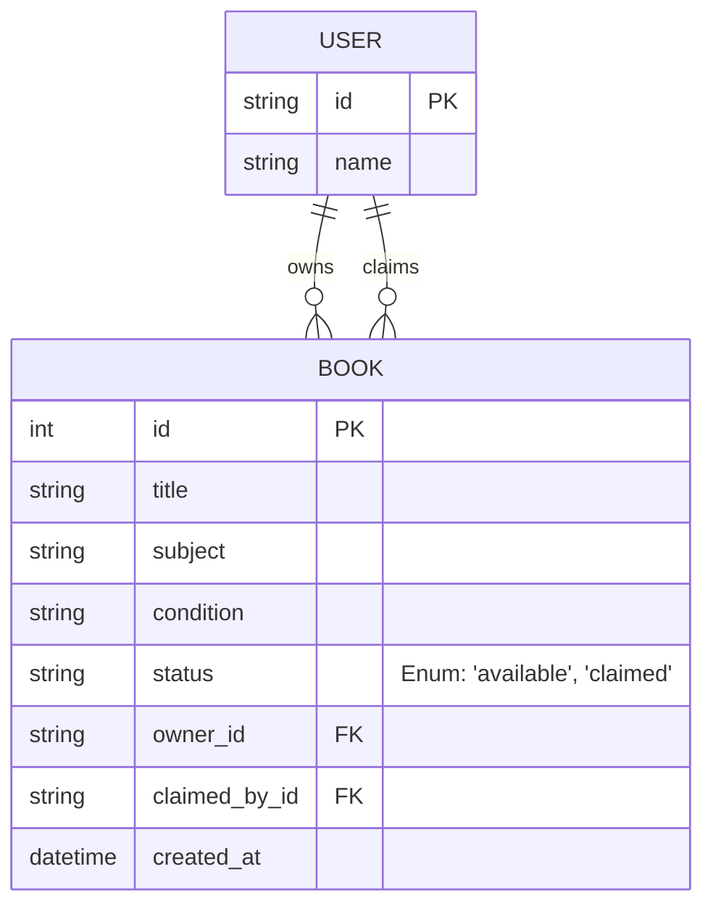

# Book Swap Shelf

A full-stack web application that allows students to list textbooks they no longer need and claim books listed by others.

## Setup Instructions

### Prerequisites
- Node.js (v18+ recommended)
- npm or yarn

### Backend Setup
1. Open a terminal and navigate to the `backend` directory:
   ```bash
   cd backend
   ```
2. Install dependencies:
   ```bash
   npm install
   ```
3. Start the server:
   ```bash
   npm run dev
   ```
   *Note: The server runs on `http://localhost:3001`. It uses SQLite, and the database file (`database.sqlite`) will be automatically created and seeded on the first run.*

### Frontend Setup
1. Open a new terminal and navigate to the `frontend` directory:
   ```bash
   cd frontend
   ```
2. Install dependencies:
   ```bash
   npm install
   ```
3. Start the Vite development server:
   ```bash
   npm run dev
   ```
   *Note: The frontend will typically run on `http://localhost:5173`. Open this URL in your browser.*

## Data Model

The application uses SQLite for persistent storage.

**ERD / Schema:**



## Assumptions Made

1. **Authentication & Identity**: The prompt mentions "My listings", "My claims", and "basic ownership checks", but full authentication wasn't specified. **Assumption**: A lightweight "mock login" system is sufficient. Users can simply type their name/ID to "log in" and act as that user. This allows testing the multi-user aspects (ownership, claiming someone else's book) without the overhead of JWTs, password hashing, etc.
2. **One-Way Claiming**: The prompt mentions "locks the book so no one else can claim it". **Assumption**: Once a book is claimed, it is permanently locked. There is no requirement for "unclaiming" or returning a book to the pool.
3. **No Book Images**: The listing requirements specify "title, subject, condition, owner". **Assumption**: Image uploads are out of scope to keep the CRUD operations straightforward and focused on the core requirements.
4. **Self-Claiming**: **Assumption**: A user should not be able to claim their own book. The backend enforces this logic.
5. **Database**: **Assumption**: SQLite is ideal here as it requires zero setup for the reviewer. The database file is generated automatically on the first backend start.
